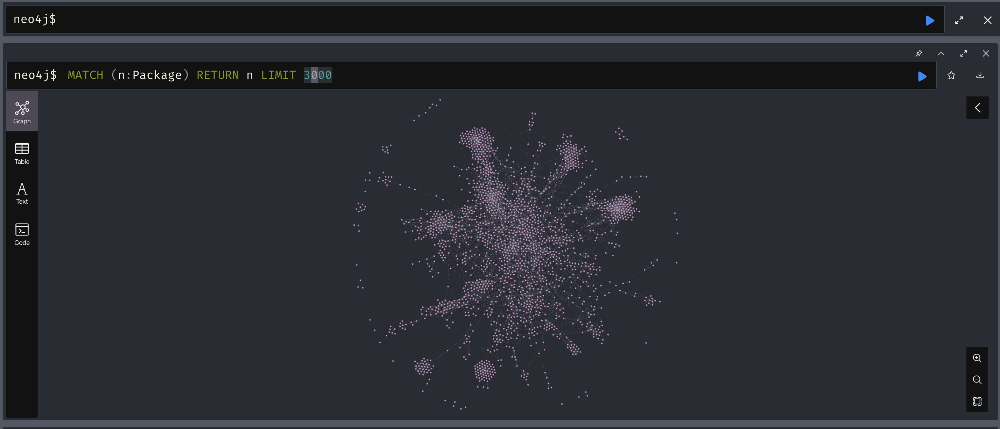
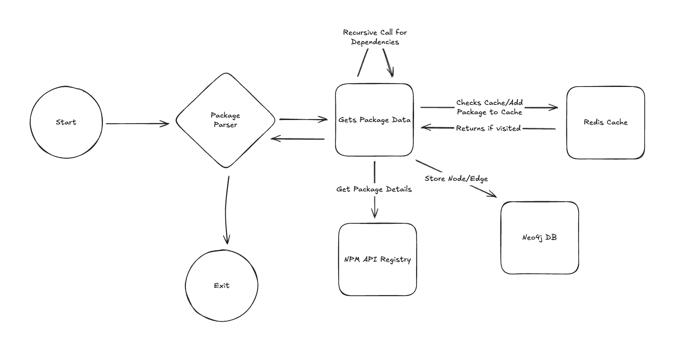

# Sentinel
A GNN-Based NPM Supply Chain Attack Detection Tool. It detects anomalies to find malicious packages within the NPM ecosystem. The tool includes a data collection tool as well to build a baseline of initial training data and uses a mix of permutation and duplication to help generate malicious package datasets. The tool will later include real-time monitoring and an accessible interface. Changes are coming soon as well to include more optimized accuracy against real-world data.

## Steps To Run Model:
NOTE: First make sure you are within the current directory

1. Create python environment: 
`python3 -m venv .venv`

2. Start python environment: 
`source .venv/bin/activate`

3. Install packages 
`pip install -r requirements.txt`

4. Run Program 
- Note: --train, --eval, and --use-real-data are optional
- Training is the default option and using real world data is disabled by default
- Option 1 (Train the model): 
`python app.py --train --use-real-data`

- Option 2 (Evaluate the model): 
`python app.py --eval --use-real-data`

## Steps To Run NPM Data Crawlers:
NOTE: First make sure you are within the current directory

1. Create python environment: 
`python3 -m venv .venv`

2. Start python environment: 
`source .venv/bin/activate`

3. Install packages 
`pip install -r requirements.txt`

4. Run Program 
`python data_crawler.py --sample <samples_fle_name>`

## Steps To Test Model
1. Run tests: 
`pytest -q --disable-warnings`

## What Sentinel does

Sentinel uses the datasets within the current directory to help either train a new model or evaluate an existing model within the model directory.
The model is named "gnn_model.pt" and is created/loaded within the model directory.

Sentinel also currently has custom data crawlers that is located within the root directory.
These crawlers may collect data straight from the NPM registry given the list of the top 1000 node packages within the `top1000packages.txt` file

These are the artifical data samples that may also be used:
- [NPM packages sample data for training (train_benign.json)](./samples/train_benign.json)
- [Malicious NPM package sample data for training (train_malicious.json)](./samples/train_malicious.json)
- [NPM package sample data for evaluation (test_benign.json)](./samples/test_benign.json)
- [Malicious NPM package sample data for evaluation (test_malicious.json)](./samples/test_malicious.json)

## Model Output

### Training
<pre>
Training model
Epoch = 0, Loss = 0.7774453163146973
Epoch = 10, Loss = 0.544178307056427
Epoch = 20, Loss = 0.45122388005256653
Epoch = 30, Loss = 0.4503107964992523
Epoch = 40, Loss = 0.41077545285224915
Epoch = 50, Loss = 0.4083067774772644
Epoch = 60, Loss = 0.4220380485057831
Epoch = 70, Loss = 0.40408775210380554
Epoch = 80, Loss = 0.4153529405593872
Epoch = 90, Loss = 0.40803200006484985
Model trained and saved to 'gnn_model.pt'.
</pre>

This output represents the loss compute during each training pass. Decreasing loss compute means that the model is actually learning. 
Model is then saved in the "gnn_model.pt" file within the current directory  

### Model Evaluation

<pre>
Evaluating model
Calculated accuracy: 0.972972972972973
</pre>

The calculated accuracy is the representation of how many classifications the model was able to get right for each node when determining whether it was benign or malicious.

## How the GNN model works
There are 5 main sections in how Sentinel works.
1. Building the graph
2. Create/Apply normalizer
3. Train model
4. Evaluate model
5. Save/Load model

Building the graph means that we take in the sample json data and convert it into a graph with nodes and edges for the GNN to consume.
I'm using pytorch since it's a well known AI/ML library to help with this. It let's us create a dictionary-like object that holds node-level,
link-level, and graph-level attributes. It's useful for storing our newly created tensors (multi-dimensional array of values for efficient computing).

With the new data, I want to be able to normalize it. Normalizing data adds uniformity and normalization to the data. This helps make sure that when new data comes, they follow a consistent rule/format/data structure. "fit_normalizer" helps to determine how the data should be normalized and "normalize" helps to apply the normalizer to the data.

Training the model is self explanatory. Based on the labels previously provided when building the initial graph of the 2 data samples (or real-world data), this function is where the model will learn to adjust and differentiate the difference between benign and malicious data. Important to note that we can watch the loss compute through each training pass to keep track of whether it’s actually learning or not. Loss compute is just the difference between the model prediction and the actual value. If the difference goes down overtime, it's a good indicator of proper training.

Evaluating the model is also self explanatory. Here, the model is given new data samples and the model is tasked to identify malicious and benign packages. The data samples have also been normalized to the same extent as the training data as well within the evaluate function. It returns an accuracy score at the end that determines how accurate it was at classifying the different nodes as either benign or malicious.

Save/Load model is just saving the model after training and loading it back when either training or evaluating. This is good for continued training on existing models so that we don't sped time having to retrain everything from scratch. It's also good for letting others evaluate data sets with your saved model.

### Data Crawler Output
<pre>
lodash
chalk
request
commander
react
express
debug
async
fs-extra
moment
prop-types
react-dom
bluebird
underscore
vue
axios
tslib
mkdirp
glob
yargs
</pre>

Output represents the packages that the data crawler has retrieved and collected package data for.

### How the Data Crawlers work

It takes a list of packages, traverses through each one and calls the API registry recusrively through each package's dependency network.
If there is a dependency found, it will create a node-edge pair on the Neo4j graph database. If it's just a single node package, it will create
just a single node. There is also a redis cache db set up to keep track of visited nodes. Eventually, the graph database will look similar to this:

## Model Diagram

## Data Crawler Diagram

