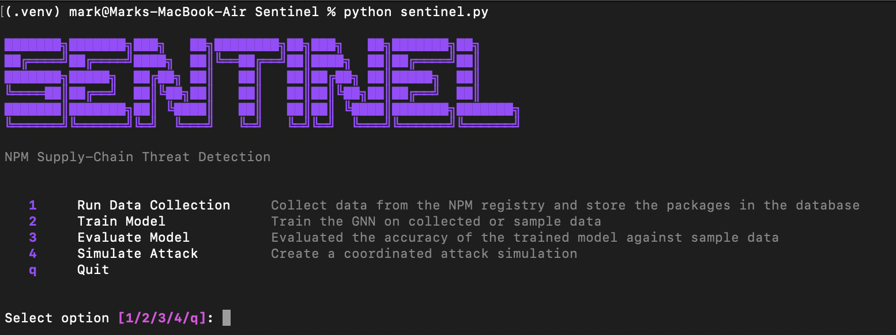
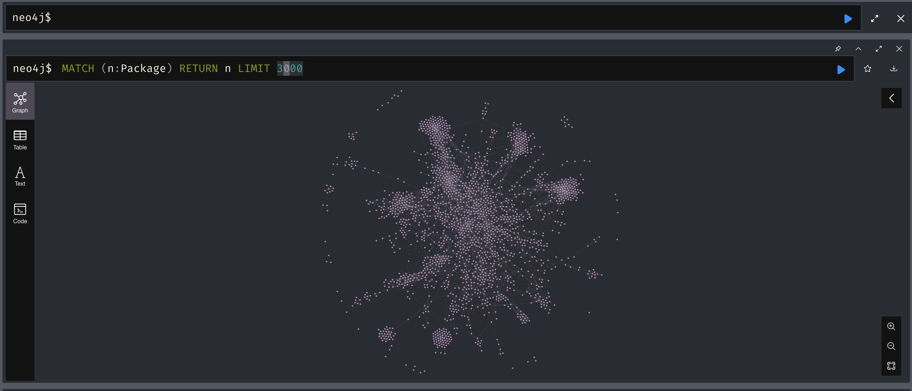

# Sentinel

A GNN-based NPM supply chain attack detection tool. Sentinel analyzes package metadata across dependency networks to flag potentially malicious packages. It trains on real-world NPM data and uses synthetic attack simulations to learn what suspicious activity looks like.

## Features

* **GNN-based detection** - Trains a Graph Neural Network on 41 package features (scripts, maintainers, downloads, naming patterns, dependency relationships, and more)
* **Attack simulation** - Generate realistic coordinated attacks (maintainer compromise, dependency injection, script injection) to test model performance
* **Real-time monitoring** - Poll any NPM package and its full dependency tree for updates, with optional threat detection on changes
* **Data collection** - Crawl the NPM registry and store full dependency networks in a Neo4j graph database

## Quick Start

### Setup

```bash
python3 -m venv .venv
source .venv/bin/activate
pip install -r requirements.txt
```

### Run the CLI

```bash
python sentinel.py
```

This opens an interactive menu with all options: data collection, training, evaluation, attack simulation, and live monitoring.



### Run the model directly

```bash
# Train
python app.py --train --use-real-data

# Evaluate
python app.py --eval --use-real-data
```

`--use-real-data` pulls from the Neo4j database. Without it, the model uses local JSON sample files.

### Run data crawlers

```bash
python data_crawler.py --samples <packages_file.txt>
```

### Run tests

```bash
pytest -q --disable-warnings
```

## How it works

1. **Data collection** - Crawls NPM registry packages and their full dependency trees, storing everything in Neo4j with Redis caching for visited nodes
2. **Graph construction** - Converts package data into a PyTorch Geometric graph where packages are nodes and dependencies are edges
3. **Training** - Feeds the graph into a 2-layer GCN with skip connections. Tracks loss to make sure the model is learning, not memorizing
4. **Evaluation** - Tests the trained model on unseen data and reports accuracy, precision, recall, and F1
5. **Monitoring** - Polls NPM for version changes in a dependency tree and runs the model against any updated packages

## Project structure

```
sentinel.py        - Main CLI application
app.py             - Direct model training/evaluation interface
data_crawler.py    - NPM registry crawlers
db.py              - Neo4j database layer
cache.py           - Redis caching layer
helpers.py         - Attack simulations and synthetic data generation
model/
  model.py         - GNN model (training, evaluation, save/load)
  build_graph.py   - Graph construction and feature extraction
samples/
  benign/          - Benign package datasets
  malicious/       - Malicious/attack simulation datasets
  top*packages.txt - Package lists for data collection
tests/             - Automated test suite
static/            - Diagrams and screenshots
```

## Tech stack

* Python, PyTorch Geometric, Rich, Neo4j, Redis, Pytest

## Diagrams

### Model


### Data Crawler


### Graph Database


